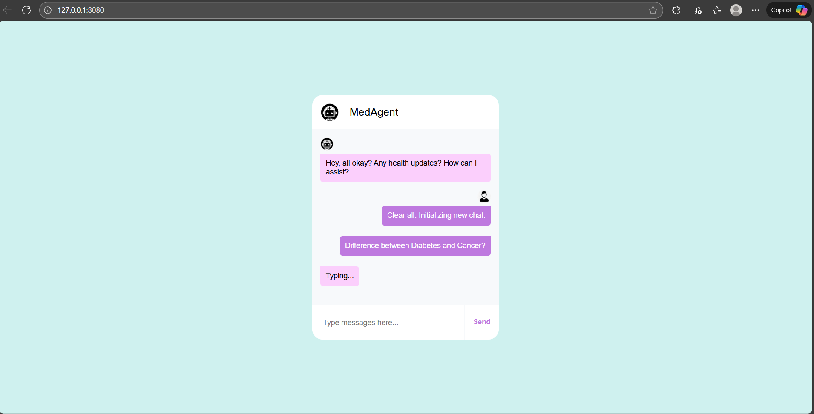

# Steps to run the project:

```bash
#conda create -n mchatbot python=3.9.13 -y
#conda activate mchatbot
#pip install -r requirements.txt

```

```bash
Clone the Repository
Project Repo:  https://github.com/immza/Medical-Chatbot-Using-Llama2.git


Step:01
Create a conda environment after opening the repository

conda create -n mchatbot python=3.9.23 -y

conda activate mchatbot

pip install -r requirements.txt

Add your pinecone credentials

Download the quantized model from the provided link:
https://huggingface.co/TheBloke/Llama-2-7B-Chat-GGML/blob/main/llama-2-7b-chat.ggmlv3.q4_0.bin
```

python template.py


